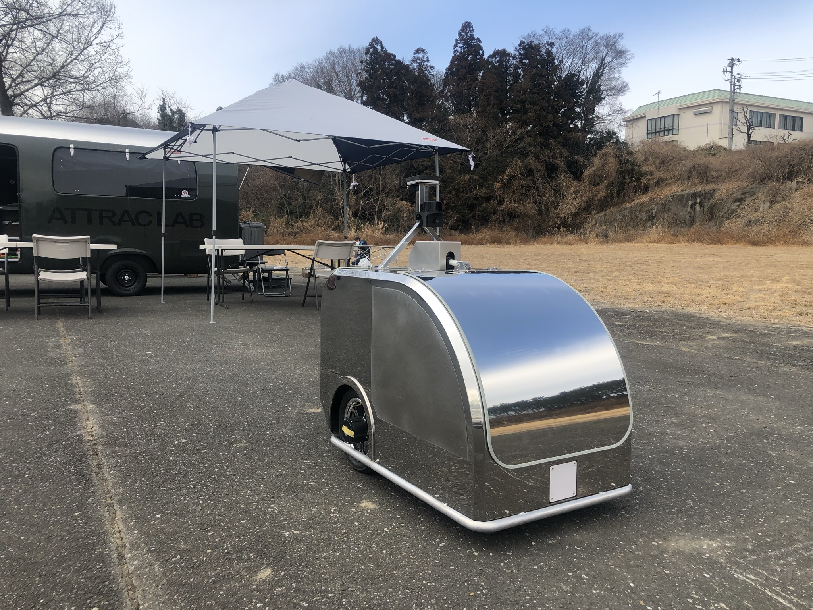
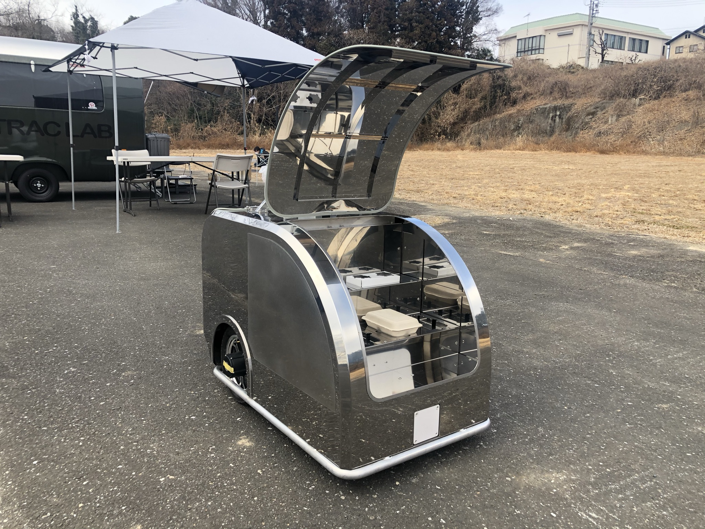
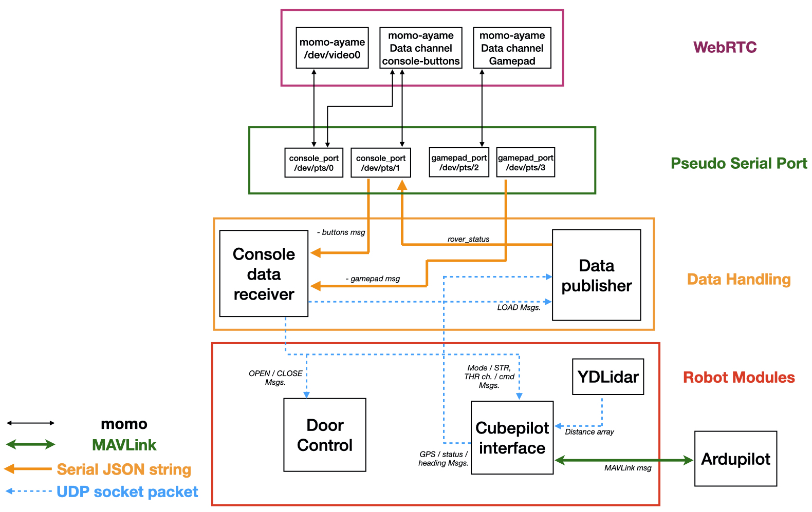

# ATCart-Delivery

A prototype code to get data from momo/ayame WebRTC to control rover.





## Dependencies
* momo binary file from [here](https://github.com/shiguredo/momo/releases)
* maestro servo controller from [here](https://github.com/FRC4564/Maestro) to control a door
* dronekit to communicate to Ardupilot `pip3 install dronekit`
* YDLidar TG30 to send distance data to Ardupilot for object avoidance [here](https://github.com/rasheeddo/testYDLidar)
* better to make a usb udev rules for each device
	* `udevadm info --name=/dev/ttyUSBx --attribute-walk` check on idVendor and idProduct
	* create rule by `sudo touch /etc/udev/rules.d/99-usb-serial.rules`
	* put this content in the file, change the symlink name to what your device name 
		```
		ACTION=="add", ATTRS{idVendor}=="xxxx", ATTRS{idProduct}=="xxxx", SYMLINK+="u2d2"
		ACTION=="add", ATTRS{idVendor}=="xxxx", ATTRS{idProduct}=="xxxx",  SYMLINK+="usb_uart"
		ACTION=="add", ATTRS{idVendor}=="xxxx", ATTRS{idProduct}=="xxxx",  SYMLINK+="ydlidar"
		```
	* reload rule by `sudo udevadm control --reload-rules`
	* `sudo reboot`

## Run
1. You will need to start two pair of /dev/pts/x port by using a scripts `1st_socat.sh` and `2nd_socat.sh` . First pair, `/dev/pts/0` and `/dev/pts/1` would be used wiht momo camera and console data channels. Second pair, `/dev/pts/2` and `/dev/pts/3` would be used for momo gamepad data channel. Once the pseudo ports are available, we can start three of momo with the correct serial port string.
2. Start Data-Handling-Modules as,

`python3 console-data-receiver.py --console_port /dev/pts/1 --gamepad_port /dev/pts/3`

`python3 data-publisher.py --console_port /dev/pts/1`

`console-data-receiver` will keep listening for the new data on `console_port` and `gamepad_port`, then it will manage those data and pass it to correct Robot-Module that needs.

`data-publisher` will get data from `cubepilot-interface` and also `LOAD` message from `console-data-receiver` and keep publishing the data with the constant rate specified at the end of script.

3. Start Robot-Modules as,

`python3 cubepilot-interface.py`

`python3 door-control.py`

`./ydlidar_cv 127.0.0.1 <your ip>` (this is from another repo)

`cubepilot-interface` will keep listening for new data from `console-data-receiver` and also the LIDAR distance message from YDLidar. In case if throttle and steering got hang up and there is no data arrive, then it will set those PWM values to middle for failsafe. `turn(), goLeft(), goRight(), goForward()` are using Ardupilot Guided mode. If `console-data-receiver` got waypoint, it will save to file and set `GOT_WP` flag to let `cubepilot-interface` knows that new mission arrived, then just upload it to the Cube.

`ydlidar_cv` is getting data from YDLidar driver TG30 and pass interested range of data to the `cubepilot-interface`.

`door-control` will keep listening for `OPEN` and `CLOSE` message from `console-data-receiver`. It's using maestro servo controller to generate PWM signal to the USB servoer controller board. The actuator is linear actuator with simple kill switch at both ends.



Please check on the diagram above.

## Note
- All of the scripts have a little delay sleep at the end to reduce CPU load, and it should be low enough not to affect on UDP socket recvfrom() function.

- Separate the code to each module and let it communicate via socket is better than put everything it one script with threading. When there is some error occurs on one module, that module just restart and not affect to other running modules.

- I am using Logicool F310 gamepad
